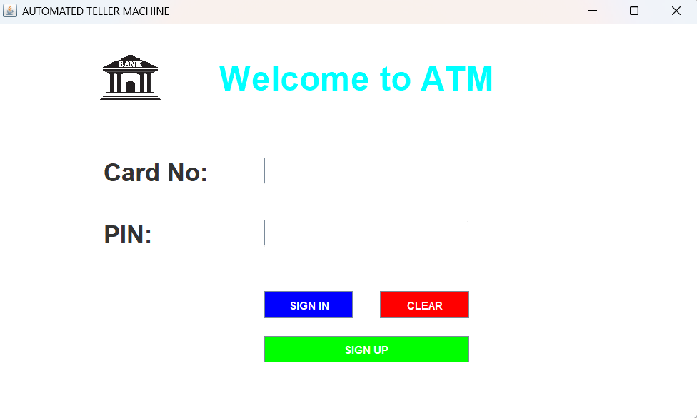
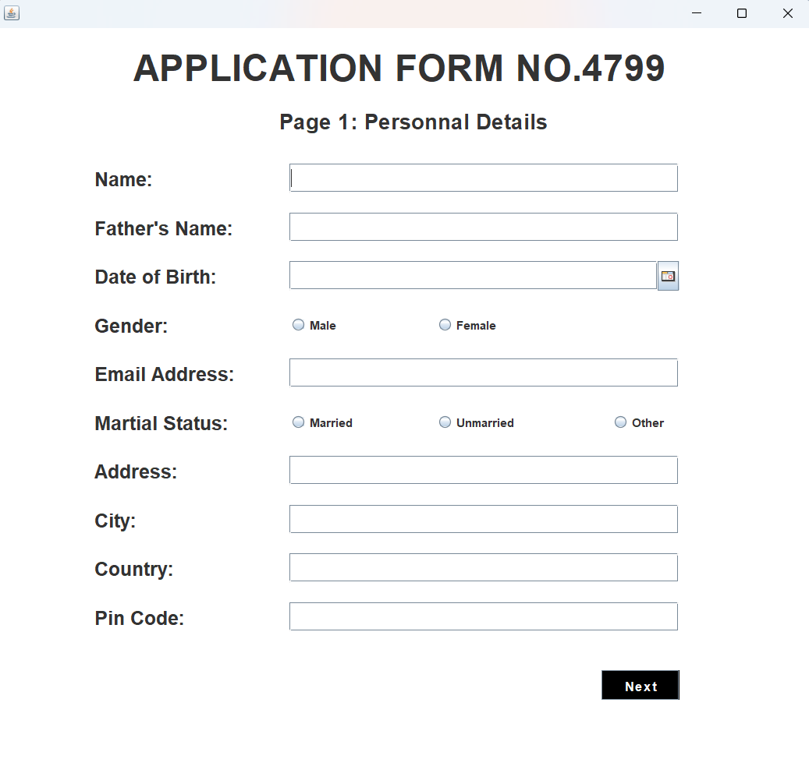
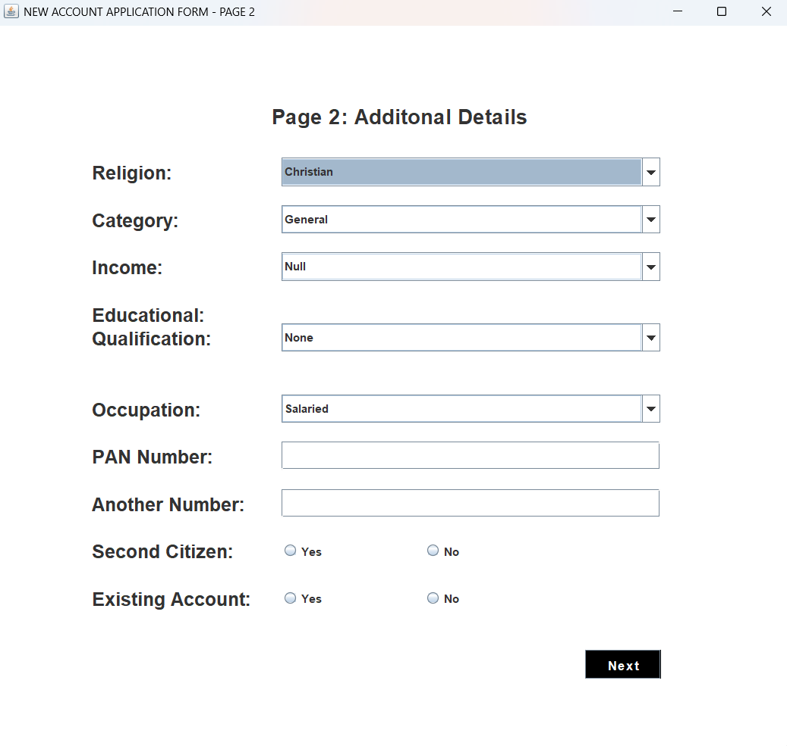
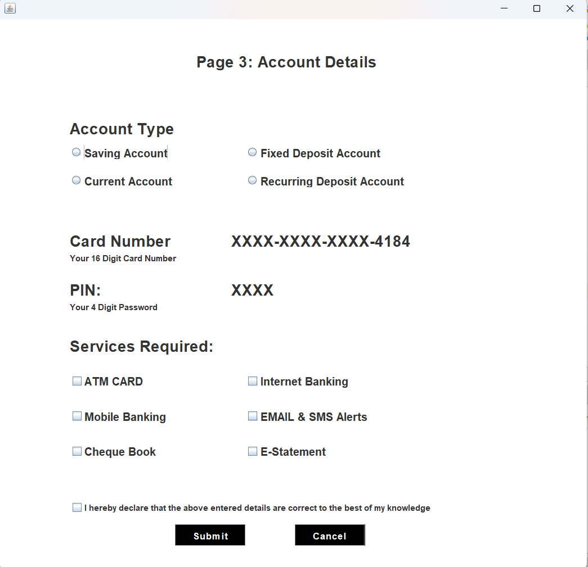
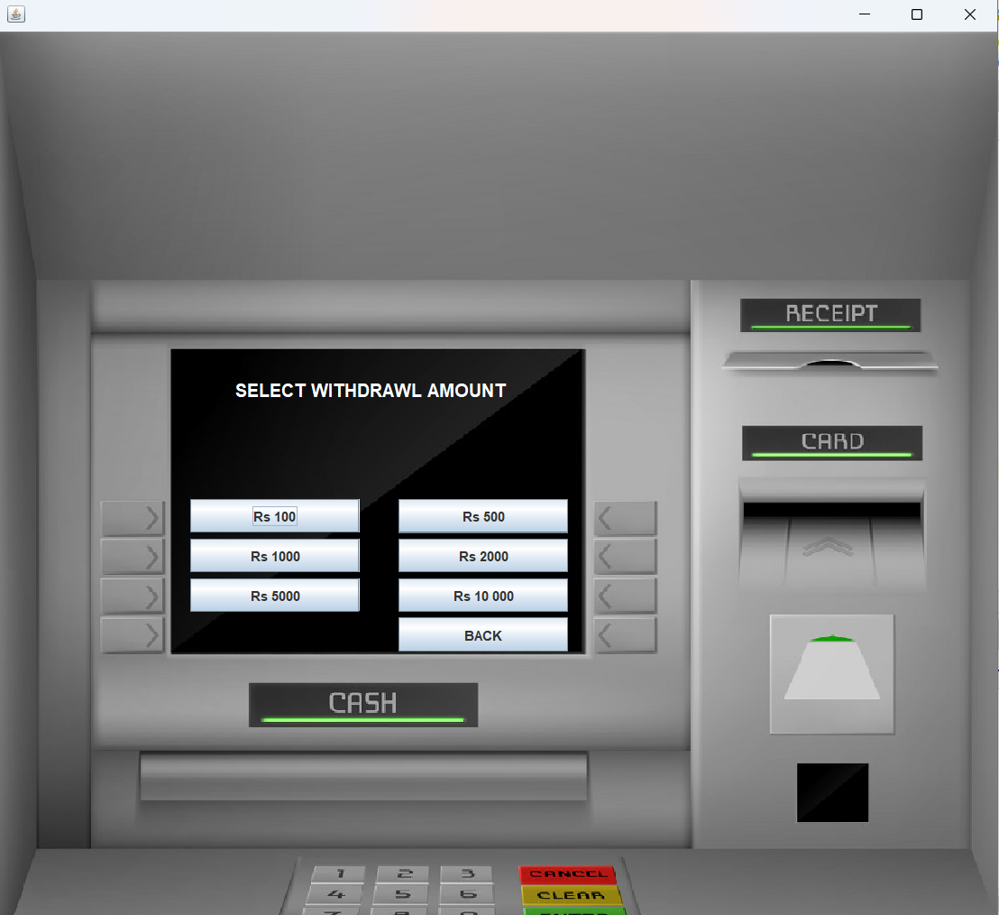
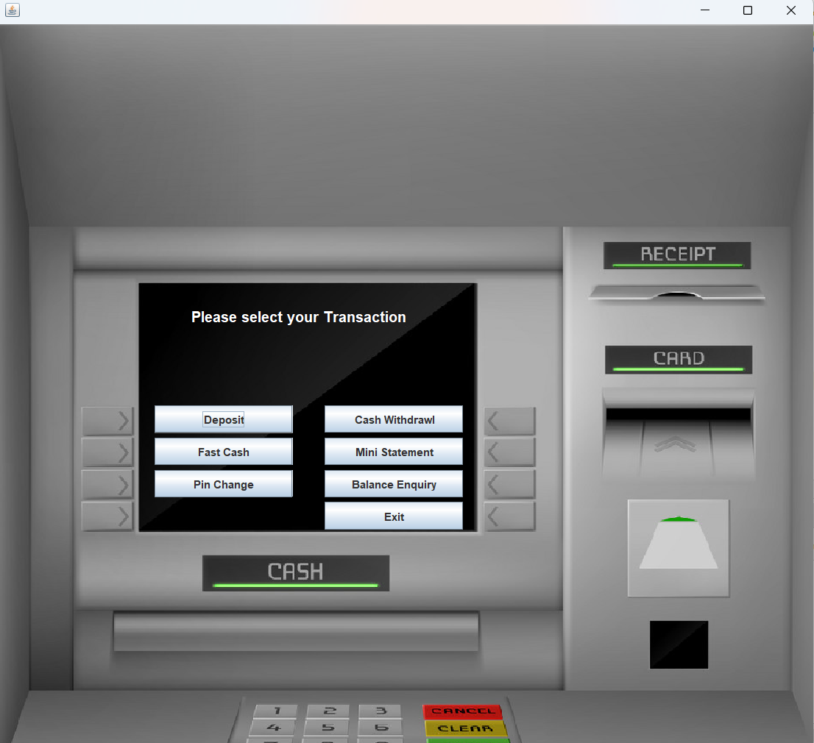
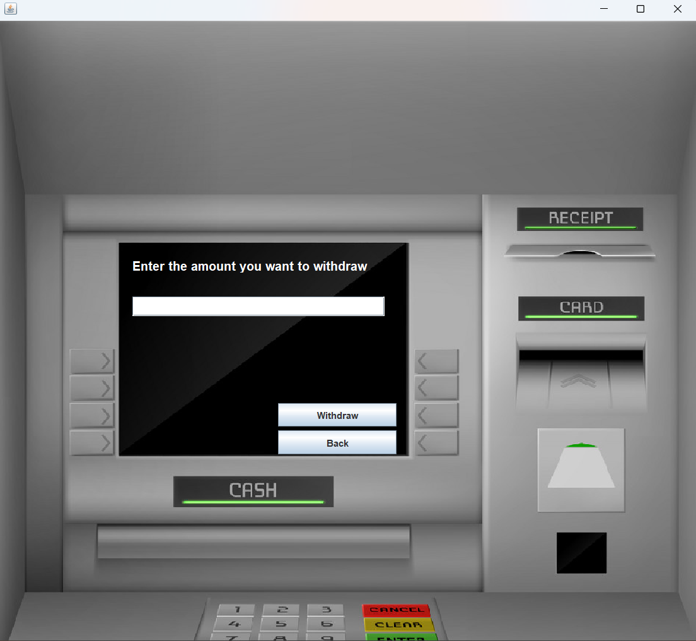

# 🏦 Bank Management System (Java Swing + MySQL)

A **Desktop Bank Management System** built in **Java Swing** with **MySQL database**.
This project allows users to **create accounts, login using card number and PIN, and perform transactions**.

I learned to create this system following the **“CODE FOR INTERVIEW” YouTube tutorial**, but this is my own version adapted for learning and practice.

---

## 📌 Features

* User signup with personal, address, and account information
* Login using **card number and PIN**
* Deposit, withdraw, and view transaction history
* Display all registered users
* Interactive **Java Swing GUI**

---

## 📷 Screenshots

**1. Login Form**



**2. Signup Form**





**3. Transactions Screen**





---

## 🗄 Database Structure

The project uses the following MySQL tables:

**1. signup** – store user personal info

```sql
formno VARCHAR(20),
name VARCHAR(20),
father_name VARCHAR(20),
dob VARCHAR(20),
gender VARCHAR(20),
email VARCHAR(30),
marital_status VARCHAR(20),
address VARCHAR(40),
city VARCHAR(25),
pincode VARCHAR(20),
state VARCHAR(25)
```

**2. signuptwo** – store additional details

```sql
formno VARCHAR(20),
religion VARCHAR(20),
category VARCHAR(20),
income VARCHAR(20),
education VARCHAR(20),
occupation VARCHAR(20),
pan VARCHAR(20),
aadhar VARCHAR(20),
seniorcitizen VARCHAR(20),
existingaccount VARCHAR(20)
```

**3. signupthree** – store account info

```sql
formno VARCHAR(20),
accountType VARCHAR(40),
cardnumber VARCHAR(25),
pin VARCHAR(10),
facility VARCHAR(100)
```

**4. login** – store login credentials

```sql
formno VARCHAR(20),
cardnumber VARCHAR(25),
pin VARCHAR(10)
```

**5. bank** – store transaction history

```sql
pin VARCHAR(10),
date VARCHAR(50),
type VARCHAR(20),
amount VARCHAR(20)
```

---

## 💻 Technologies Used

* **Java** (Swing for GUI)
* **MySQL** (database backend)
* **JDBC** (Java Database Connectivity)
* **NetBean**

---

## ⚡ Installation & Setup

1. Clone the repository:

```bash
git clone https://github.com/YOUR_USERNAME/bank-management-system.git
```

2. Import the project in **NetBeans** or your preferred IDE.
3. Setup the **MySQL database** using the provided queries.
4. Update the **database connection** in `Conn.java` with your MySQL credentials.
5. Run `Login.java` to start the application.

---

## 📺 Tutorial Credit

I learned to create this system from the **“CODE FOR INTERVIEW” YouTube channel**:
* Channel: [https://www.youtube.com/channel/UCo9P-eIdR00Fn1gA_ylaHdQ](https://www.youtube.com/channel/UCo9P-eIdR00Fn1gA_ylaHdQ)
* Playlist: [Bank Management System Tutorial](https://www.youtube.com/watch?v=pMR_48AF-A0&list=PL_6klLfS1WqG8mRCW5a-bIViq1DbzQkp9)

---

## ⭐ Support & Contribution

* Please **star the repo** if you like it.
* Feel free to fork and make improvements!

